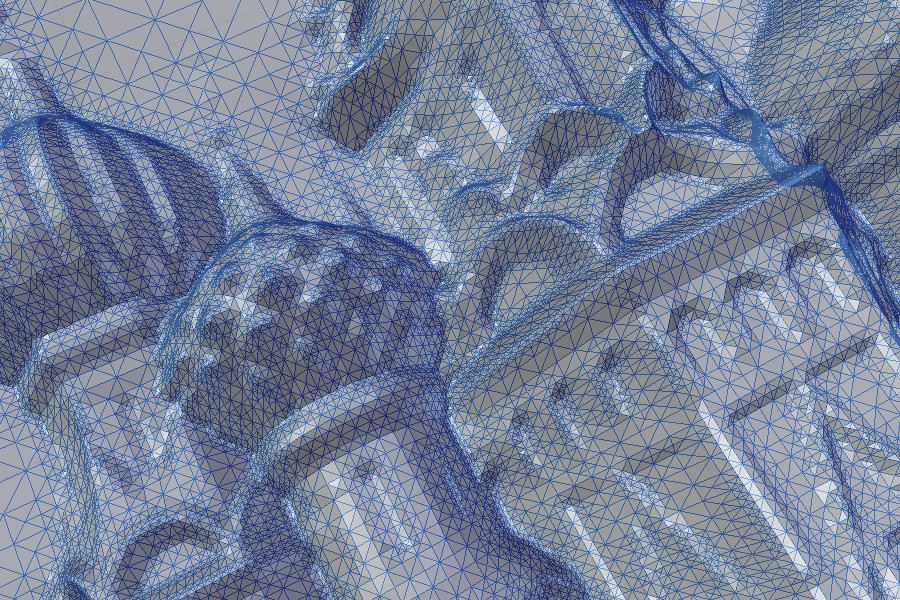
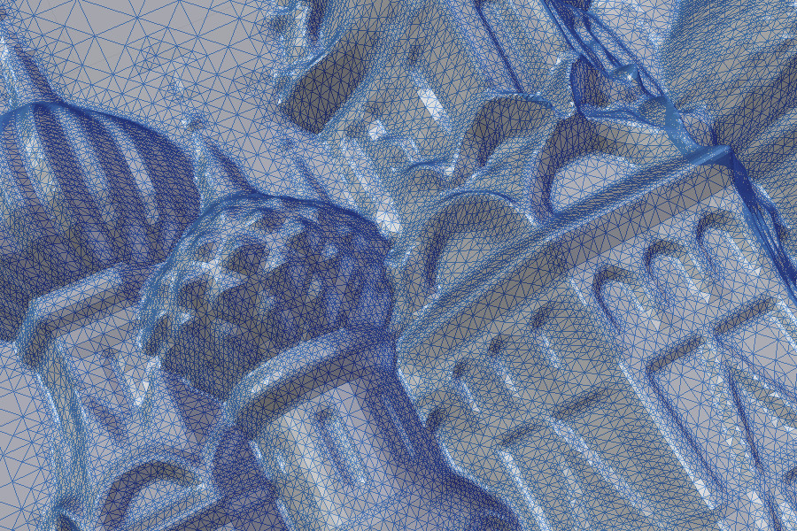

# TGA2STL
This is a command-line utility that I spent a week or two writing at the beginning of 2016 and then completely forgot about. I stumbled across it by chance and decided it was in good enough shape to justify becoming my first github project :D

There are several depthmap/heightmap-to-mesh programs out there but they meshes they output are cumbersome to work with. These programs strictly generate a grid of triangles with vertex heights dictated by input image pixel brightness. TGA2STL, however, starts with a coarse grid of triangles and subdivides wherever it detects more detail in the input image. The end result is a pre-optimized mesh that is more friendly to 3D programs, such as CAM software, 3D printing model-slicers, and modeling/animation packages.

 I had even started using Blender to create meshes from depthmaps for milling on my hobby CNC and this was quite a chore for something you would think is not that complicated. I wish I had remembered that I wrote this program before I endured that learning curve!
 
 TGA2STL is also very fast. It can generate a 100k triangle mesh in less than a second.

# Usage
Using TGA2STL is as easy as dragging and dropping your 24 or 32 bit TGA depthmap onto TGA2STL.EXE which will then popup a window showing details about the binary tree nodes and number of triangles generated. This will use the default parameters.

If you run TGA2STL from the command-line without an input image argument it will display usage information:

'thresh' designates the threshold at which the mesh's deviation from the input image triggers a triangle subdivide.

'smooths' sets the number of simple 3x3 height value averages to perform across the input image data before generating the mesh. This helps to prevent extraneous subdivisions from occurring, minimizing triangle-count. However, this is at the expense of retaining detail in the final mesh.

'hscale' allows establishing how many pixels to each mesh unit. If you have a 512x512 image, for instance, and set hscale to 128 then the output mesh will be 4x4 model units. I personally interpret them as inches, and so hscale can be considered pixels-per-inch.

'vscale', similarly, establishes how many mesh units the RGB 0-255 range should span. The default is 256, thus the full range of an image's 0-255 color range is capable of generating a mesh with a vertical size of one mesh unit. If you want a shallower mesh then use a larger number. For a mesh that's 0.25 units tall you would use 1024, as the 0-255 range goes into 1024 four times.

Here's a 512x512 depthmap I've been using for testing.

This is the mesh generated from the depthmap using a subdivide threshold of 0.25 with all other parameters at their defaults. (39k triangles)

Here's the mesh output with thresh set to 0.125. (78k triangles)

...and 0.0625. (135k triangles)

# Limitations and Requirements
There are some limitations as to what TGA2STL can work with insofar as the depthmap images themselves are concerned:

- Depthmap TGA files must not be run-length encoded. The origin can, however, be top-left or bottom-left (some imaging programs like to default to either, which can make loading TGA's tricky).

- Depthmap dimensions must be a power of two. It *will* work with non-power-of-two dimensions, but you'll get a gross pixellated stair-stepping resultant mesh, which is a product of the nearest sampling of the depthmap data. With the addition of a linear interpolation, at the very least, this restriction would be resolved.

- Rectangular depthmaps (i.e. non-square) *do* work but the mesh division isn't uniform. The starting base triangle mesh that is initialized is matched to the input image dimensions, but divisions still occur at halfway points and are not distributed based on the width/height ratio of the image. Not sure if this is something I'm interested in ever resolving.

